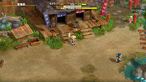

# Overview

There are many notable overworld areas in the game, and each village has its own NPCs and facilities. For events and side quests, check the [Side Quests](/system/side-quests) page.

# Village List

[Content]

## Shukuba Beach

  <table class="locationTable">
    <thead>
      <tr>
        <th colspan="9" class="highlightGray">Location</th>
      </tr>
    </thead>
    <tbody>
      <tr>
        <td rowspan="2" class="currentLocation">Shukuba Beach</td>
        <td>Sozoro Bay</td>
        <td>Suzunari Pass</td>
        <td rowspan="2">Mountain Village</td>
        <td>Mount Jingara</td>
        <td rowspan="2">Small Harbor</td>
        <td>Underwater Passage</td>
        <td rowspan="2">Underwater Training Ground</td>
        <td>Underwater Passage</td>
      </tr>
      <tr>
        <td>1~2F</td>
        <td>3~4F</td>
        <td>5~9F</td>
        <td>10-12F</td>
        <td>13-15F</td>
      </tr>
    </tbody>
  </table>

 

  

#### Uzumaki-Ya (Inn)

- This is where you return to if you collapse.

#### Warehouse

- Leave items on the ground to store them.
    - Items inserted into a Warehouse Pot get sent here.
- 25 tiles total. (5x5)

#### Exit

- Head out to any dungeon you've unlocked.

#### Item Holder (Storehouse / Bank)

- Store a maximum of 180 items, and Gitan can also be stored.
    - Unlocked after the first clear of Serpentcoil Island.

#### Traveling Blacksmith

- Text

#### Unsuspicious Shop

- Text

#### Wagoneer

- Fast-travel to other villages and overworld areas.
    - Unlocked after the second clear of Serpentcoil Island.

#### Momoman Shop

- Shop that sells 5 random Momoman per day.
    - She prioritizes selling Momoman that are not registered in your notebook.
    - Unlocked after clearing the Momoman Side Quest.

#### Stone Monument

- Access hard mode of the 99F dungeon from here after clearing the 99F dungeon once.

## Mountain Village

  <table class="locationTable">
    <thead>
      <tr>
        <th colspan="9" class="highlightGray">Location</th>
      </tr>
    </thead>
    <tbody>
      <tr>
        <td rowspan="2">Shukuba Beach</td>
        <td>Sozoro Bay</td>
        <td>Suzunari Pass</td>
        <td rowspan="2" class="currentLocation">Mountain Village</td>
        <td>Mount Jingara</td>
        <td rowspan="2">Small Harbor</td>
        <td>Underwater Passage</td>
        <td rowspan="2">Underwater Training Ground</td>
        <td>Underwater Passage</td>
      </tr>
      <tr>
        <td>1~2F</td>
        <td>3~4F</td>
        <td>5~9F</td>
        <td>10-12F</td>
        <td>13-15F</td>
      </tr>
    </tbody>
  </table>

 

  

#### Village Market (Item Shop)

- A number of items are randomly selected from the following:

[Shop Item List]

#### Village Blacksmith

- Service can only be performed once per adventure.
- Upgrade: 1000 Gitan.
    - Increase a selected weapon or shield's upgrade value by 1.
    - Small chance to increase by 3.

## Small Harbor

  <table class="locationTable">
    <thead>
      <tr>
        <th colspan="9" class="highlightGray">Location</th>
      </tr>
    </thead>
    <tbody>
      <tr>
        <td rowspan="2">Shukuba Beach</td>
        <td>Sozoro Bay</td>
        <td>Suzunari Pass</td>
        <td rowspan="2">Mountain Village</td>
        <td>Mount Jingara</td>
        <td rowspan="2" class="currentLocation">Small Harbor</td>
        <td>Underwater Passage</td>
        <td rowspan="2">Underwater Training Ground</td>
        <td>Underwater Passage</td>
      </tr>
      <tr>
        <td>1~2F</td>
        <td>3~4F</td>
        <td>5~9F</td>
        <td>10-12F</td>
        <td>13-15F</td>
      </tr>
    </tbody>
  </table>

#### Daily Mart (Item Shop)

#### Harbor Inn Yuunagi

## Underwater Training Ground

  <table class="locationTable">
    <thead>
      <tr>
        <th colspan="9" class="highlightGray">Location</th>
      </tr>
    </thead>
    <tbody>
      <tr>
        <td rowspan="2" class="currentLocation">Underwater Training Ground</td>
        <td>Kibanuma Marsh</td>
        <td>Firespew Mountain</td>
        <td rowspan="2">Hot Spring Cabin</td>
        <td>Firespew Mountain</td>
        <td>Mount Jatou</td>
        <td rowspan="2">Icewall Village</td>
        <td>Mount Jatou</td>
        <td rowspan="2">Mount Jatou Summit</td>
      </tr>
      <tr>
        <td>16~17F</td>
        <td>18F</td>
        <td>19~23F</td>
        <td>24~26F</td>
        <td>27~30F</td>
      </tr>
    </tbody>
  </table>

#### Training Ground Blacksmith

## Hot Spring Cabin

  <table class="locationTable">
    <thead>
      <tr>
        <th colspan="9" class="highlightGray">Location</th>
      </tr>
    </thead>
    <tbody>
      <tr>
        <td rowspan="2">Underwater Training Ground</td>
        <td>Kibanuma Marsh</td>
        <td>Firespew Mountain</td>
        <td rowspan="2" class="currentLocation">Hot Spring Cabin</td>
        <td>Firespew Mountain</td>
        <td>Mount Jatou</td>
        <td rowspan="2">Icewall Village</td>
        <td>Mount Jatou</td>
        <td rowspan="2">Mount Jatou Summit</td>
      </tr>
      <tr>
        <td>16~17F</td>
        <td>18F</td>
        <td>19~23F</td>
        <td>24~26F</td>
        <td>27~30F</td>
      </tr>
    </tbody>
  </table>

#### Warehouse

## Icewall Village

  <table class="locationTable">
    <thead>
      <tr>
        <th colspan="9" class="highlightGray">Location</th>
      </tr>
    </thead>
    <tbody>
      <tr>
        <td rowspan="2">Underwater Training Ground</td>
        <td>Kibanuma Marsh</td>
        <td>Firespew Mountain</td>
        <td rowspan="2">Hot Spring Cabin</td>
        <td>Firespew Mountain</td>
        <td>Mount Jatou</td>
        <td rowspan="2" class="currentLocation">Icewall Village</td>
        <td>Mount Jatou</td>
        <td rowspan="2">Mount Jatou Summit</td>
      </tr>
      <tr>
        <td>16~17F</td>
        <td>18F</td>
        <td>19~23F</td>
        <td>24~26F</td>
        <td>27~30F</td>
      </tr>
    </tbody>
  </table>

#### Mysterious Peddler

#### Popke Inn
