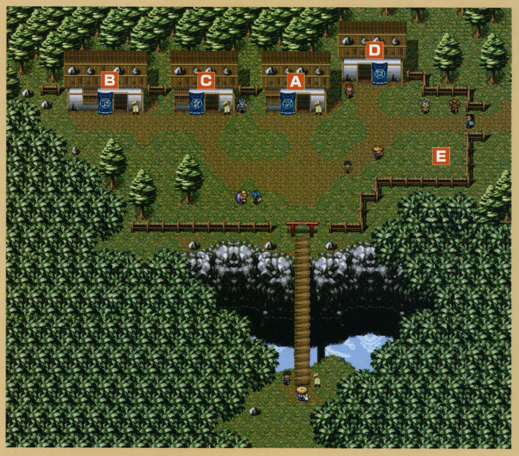
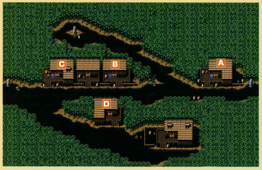
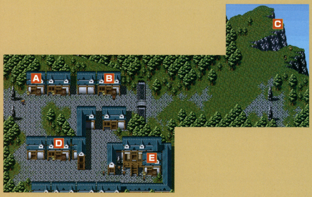
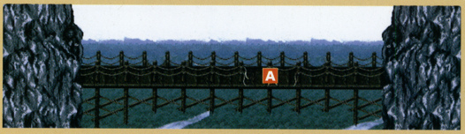
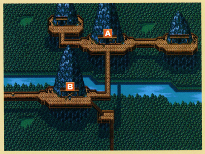
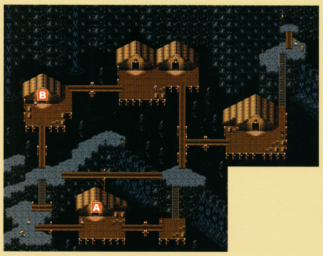
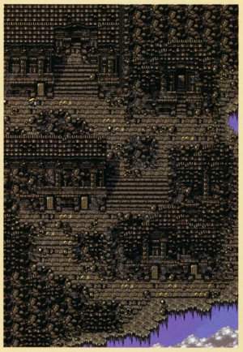

# Overview

There are 7 notable overworld areas in the game, and each village has its own NPCs and facilities. For events and side quests, check the [Side Quests](/system/side-quests) page.

# Canyon Hamlet

  <table class="locationTable">
    <thead>
      <tr>
        <th colspan="9" class="highlightGray">Location</th>
      </tr>
    </thead>
    <tbody>
      <tr>
        <td rowspan="2" class="currentLocation">Canyon Hamlet</td>
        <td>Old Cedar Road</td>
        <td>Mountain Stream</td>
        <td rowspan="2">Bamboo Village</td>
        <td>Pegasus Ridge</td>
        <td>Mountaintop Forest </td>
        <td rowspan="2">Mountaintop Town</td>
        <td>Old Mine</td>
        <td rowspan="2">Janus Valley</td>
      </tr>
      <tr>
        <td>1~2F</td>
        <td>3~4F</td>
        <td>5~6F</td>
        <td>7F</td>
        <td>8~9F</td>
      </tr>
    </tbody>
  </table>

  

#### A - The Traveling Crow (Inn)

- This is where you return to if you collapse.

#### B - Smoke and Dad's (Bar)

- Talk to the Barman to receive a Big Riceball. (Once per adventure)

#### C - Warehouse

- Leave items on the ground to store them.
- 25 tiles total. (5x5)

#### D - Fay's Puzzles

- See Fay's Puzzles for details.

##### Broken Trap Recycling

- Turn in Broken Traps for a random reward.
- Available once Scroll Cave is unlocked.

 

|Qty|Possible Rewards|
|-|-|
|1~3|Medicinal Herb, Scroll of Light, Riceball, Antidote Herb|
|4~6|Medicinal Herb, Scroll of Light, Antidote Herb, Riceball, Restorative Herb, Scroll of Blessing|
|7~9|Restorative Herb, Scroll of Blessing, Blastwave Scroll, Plating Scroll, Herb of Strength|
|10~11|Herb of Strength, Plating Scroll, Air Bless Scroll, Earth Bless Scroll, Herb of Life|
|12~14|Air Bless Scroll, Earth Bless Scroll, Herb of Life, Big Belly Seed|
|15|Air Bless Scroll, Earth Bless Scroll, Herb of Life, Blank Scroll, Giant Riceball|
|16|Air Bless Scroll, Earth Bless Scroll, Blank Scroll, Giant Riceball|
|17~18|Air Bless Scroll, Earth Bless Scroll, Blank Scroll, Giant Riceball, Happiness Herb|
|19|Blank Scroll, Happiness Herb, Giant Riceball, Special Riceball, Herb of Revival|
|20|Blank Scroll, Happiness Herb, Special Riceball, Herb of Revival|

#### E - Gara the Wagoner

- Fast-travel to other villages and overworld areas.

 

<table class="dungeonTable">
  <thead>
    <tr>
      <th>Location</th>
      <th>Unlock Condition</th>
    </tr>
  </thead>
  <tbody>
    <tr>
      <td>Bamboo Village</td>
      <td>Reach Cryptic Rock Valley</td>
    </tr>
    <tr>
      <td>Mountaintop Town</td>
      <td>Reach Stream Village</td>
    </tr>
    <tr>
      <td>Janus Valley</td>
      <td>Clear Table Mountain</td>
    </tr>
    <tr>
      <td>Cryptic Rock Valley</td>
      <td>Clear Table Mountain</td>
    </tr>
    <tr>
      <td>Golden City</td>
      <td>Clear Table Mountain</td>
    </tr>
  </tbody>
</table>

# Bamboo Village

  <table class="locationTable">
    <thead>
      <tr>
        <th colspan="9" class="highlightGray">Location</th>
      </tr>
    </thead>
    <tbody>
      <tr>
        <td rowspan="2">Canyon Hamlet</td>
        <td>Old Cedar Road</td>
        <td>Mountain Stream</td>
        <td rowspan="2" class="currentLocation">Bamboo Village</td>
        <td>Pegasus Ridge</td>
        <td>Mountaintop Forest </td>
        <td rowspan="2">Mountaintop Town</td>
        <td>Old Mine</td>
        <td rowspan="2">Janus Valley</td>
      </tr>
      <tr>
        <td>1~2F</td>
        <td>3~4F</td>
        <td>5~6F</td>
        <td>7F</td>
        <td>8~9F</td>
      </tr>
    </tbody>
  </table>

  

#### A - Yoidore (Bar)

- Talk to people for advice.

#### B - Fudou (Blacksmith)

- Service can only be performed once per adventure.
- Upgrade: 1000 Gitan.
    - Increase weapon upgrade value by 1.
    - Small chance to increase by 3.

#### C - Green Bamboo (Shop)

- A number of items are randomly selected from the following:

 

<table class="itemDetailsTable">
  <thead>
    <tr>
      <th colspan="6">Bamboo Village (Item Shop)</th>
    </tr>
    <tr>
      <th class="highlightGray">Item</th>
      <th class="highlightGray">Price</th>
      <th class="highlightGray">Item</th>
      <th class="highlightGray">Price</th>
      <th class="highlightGray">Item</th>
      <th class="highlightGray">Price</th>
    </tr>
  </thead>
  <tbody>
    <tr>
      <td>Cudgel</td>
      <td>400</td>
      <td>Restorative Herb</td>
      <td>600</td>
      <td>Staff of Postpone</td>
      <td>500+Nx50</td>
    </tr>
    <tr>
      <td>Polearm</td>
      <td>600</td>
      <td>Herb of Sight</td>
      <td>600</td>
      <td>Knockback Staff</td>
      <td>500+Nx50</td>
    </tr>
    <tr>
      <td>Katana</td>
      <td>800</td>
      <td>Herb of Strength</td>
      <td>800</td>
      <td>Staff of Sloth</td>
      <td>700+Nx70</td>
    </tr>
    <tr>
      <td>Mastersword</td>
      <td>1500</td>
      <td>Herb of Life</td>
      <td>1000</td>
      <td>Switching Staff</td>
      <td>700+Nx70</td>
    </tr>
    <tr>
      <td>Bronzeward</td>
      <td>600</td>
      <td>Scroll of Light</td>
      <td>300</td>
      <td>Pain Sharing Staff</td>
      <td>1200+Nx120</td>
    </tr>
    <tr>
      <td>Iron Shield</td>
      <td>2000</td>
      <td>Scroll of Blessing</td>
      <td>500</td>
      <td>Staff of Stability</td>
      <td>1200+Nx120</td>
    </tr>
    <tr>
      <td>Hide Shield</td>
      <td>1200</td>
      <td>Earth Bless Scroll</td>
      <td>800</td>
      <td>Staff of Paralysis</td>
      <td>1500+Nx150</td>
    </tr>
    <tr>
      <td>Walrus Shield</td>
      <td>3100</td>
      <td>Air Bless Scroll</td>
      <td>800</td>
      <td>Doppelganger Staff</td>
      <td>1500+Nx150</td>
    </tr>
    <tr>
      <td>Riceball</td>
      <td>150</td>
      <td>Plating Scroll</td>
      <td>2000</td>
      <td>Lightning Staff</td>
      <td>2000+Nx200</td>
    </tr>
    <tr>
      <td>Big Riceball</td>
      <td>300</td>
      <td>Mamel Meat</td>
      <td>300</td>
      <td>Jar of Change</td>
      <td>1200+Nx120</td>
    </tr>
    <tr>
      <td>Antidote Herb</td>
      <td>300</td>
      <td>Pickpocket Meat</td>
      <td>2000</td>
      <td>Jar of Holding</td>
      <td>1200+Nx120</td>
    </tr>
    <tr>
      <td>Medicinal Herb</td>
      <td>300</td>
      <td>Bowboy Meat</td>
      <td>2000</td>
      <td>Chiropractic Jar</td>
      <td>1500+Nx150</td>
    </tr>
  </tbody>
</table>

#### D - Stray Cat (Wagon House)

- Fast-travel to other villages and overworld areas.

 

<table class="dungeonTable">
  <thead>
    <tr>
      <th>Location</th>
      <th>Unlock Condition</th>
    </tr>
  </thead>
  <tbody>
    <tr>
      <td>Mountaintop Town</td>
      <td>Reach Stream Village</td>
    </tr>
    <tr>
      <td>Janus Valley</td>
      <td>Clear Table Mountain</td>
    </tr>
    <tr>
      <td>Cryptic Rock Valley</td>
      <td>Clear Table Mountain</td>
    </tr>
    <tr>
      <td>Golden City</td>
      <td>Clear Table Mountain</td>
    </tr>
  </tbody>
</table>

# Mountaintop Town

  <table class="locationTable">
    <thead>
      <tr>
        <th colspan="9" class="highlightGray">Location</th>
      </tr>
    </thead>
    <tbody>
      <tr>
        <td rowspan="2">Canyon Hamlet</td>
        <td>Old Cedar Road</td>
        <td>Mountain Stream</td>
        <td rowspan="2">Bamboo Village</td>
        <td>Pegasus Ridge</td>
        <td>Mountaintop Forest </td>
        <td rowspan="2" class="currentLocation">Mountaintop Town</td>
        <td>Old Mine</td>
        <td rowspan="2">Janus Valley</td>
      </tr>
      <tr>
        <td>1~2F</td>
        <td>3~4F</td>
        <td>5~6F</td>
        <td>7F</td>
        <td>8~9F</td>
      </tr>
    </tbody>
  </table>

  

#### A - The Resting Tree (Inn)

- Pay 500 Gitan to fully restore HP and fullness.

#### B - Storage Center (Warehouse)

- Leave items on the ground to store them.
- 15 tiles total. (3x5)

#### C - The Cliffs (Diner)

- Unlocked by progressing Naoki's sidequest.
- Eat a free meal which fully replenishes fullness and grants bonus effects.
- One menu item is randomly selected from the following:

 

<table class="itemDetailsTable">
  <thead>
    <tr>
      <th colspan="6" class="highlightOrange">Diner Menu</th>
    </tr>
    <tr>
      <th class="highlightGray">Meal</th>
      <th colspan="4" class="highlightGray">Effects</th>
    </tr>
  </thead>
  <tbody>
    <tr>
      <td class="highlightYellow">Golden Roasted Fluffy Bunny</td>
      <td>Restore HP</td>
      <td>Max HP +10</td>
      <td>-</td>
      <td>-</td>
    </tr>
    <tr>
      <td class="highlightYellow">Air Devil a la Diabolo</td>
      <td>Restore strength</td>
      <td>Max strength +1</td>
      <td>Exp +100</td>
      <td>-</td>
    </tr>
    <tr>
      <td class="highlightYellow">Boiled Ghost Radish</td>
      <td>Restore HP</td>
      <td>Max HP +3</td>
      <td>Exp +100</td>
      <td>-</td>
    </tr>
    <tr>
      <td class="highlightYellow">Gather Stew</td>
      <td>Restore strength</td>
      <td>Max strength +2</td>
      <td>Max fullness +1</td>
      <td>-</td>
    </tr>
    <tr>
      <td class="highlightYellow">Chintala Curry</td>
      <td>Restore strength</td>
      <td>Max strength +1</td>
      <td>Max fullness +3</td>
      <td>-</td>
    </tr>
    <tr>
      <td class="highlightYellow">Sauteed Piggy</td>
      <td>Restore HP</td>
      <td>Max HP +3</td>
      <td>Restore strength</td>
      <td>Max strength +5</td>
    </tr>
    <tr>
      <td class="highlightYellow">Walrus Stir-fry</td>
      <td>Max fullness +3</td>
      <td>Plate equipment</td>
      <td>-</td>
      <td>-</td>
    </tr>
    <tr>
      <td class="highlightYellow">Dragon Curry</td>
      <td>Restore strength</td>
      <td>Max strength +1</td>
      <td>Equipment strength +1</td>
      <td>-</td>
    </tr>
    <tr>
      <td class="highlightYellow">Spike Bomb Bowl</td>
      <td>Restore HP</td>
      <td>Max HP +3</td>
      <td>Max fullness +3</td>
      <td>-</td>
    </tr>
    <tr>
      <td class="highlightYellow">Pacorepkin Potage</td>
      <td>Exp +100</td>
      <td>Remove curses</td>
      <td>-</td>
      <td>-</td>
    </tr>
    <tr>
      <td class="highlightYellow">Snaky Stew</td>
      <td>Max fullness +3</td>
      <td>Exp +100</td>
      <td>-</td>
      <td>-</td>
    </tr>
    <tr>
      <td class="highlightYellow">Grilled Egg Thing</td>
      <td>Restore HP</td>
      <td>Max HP +1</td>
      <td>Max fullness +5</td>
      <td>-</td>
    </tr>
    <tr>
      <td class="highlightYellow">Corpse Ice Cream</td>
      <td>Restore HP</td>
      <td>Max HP +3</td>
      <td>Remove curses</td>
      <td>-</td>
    </tr>
    <tr>
      <td class="highlightYellow">Deep-fried Master Hen</td>
      <td>Max fullness +1</td>
      <td>Exp +500</td>
      <td>-</td>
      <td>-</td>
    </tr>
    <tr>
      <td class="highlightYellow">Roasted Mamel Tail</td>
      <td>Restore HP</td>
      <td>Max HP +3</td>
      <td>Restore strength</td>
      <td>Max strength +1</td>
    </tr>
    <tr>
      <td class="highlightYellow">Filet de Minotaur</td>
      <td>Restore strength</td>
      <td>Max strength +1</td>
      <td>-</td>
      <td>-</td>
    </tr>
    <tr>
      <td class="highlightYellow">Dark Owl Cuisine</td>
      <td>Remove curses</td>
      <td>Plate equipment</td>
      <td>-</td>
      <td>-</td>
    </tr>
    <tr>
      <td class="highlightYellow">Rice Baby Riceball</td>
      <td>Max fullness +10</td>
      <td>-</td>
      <td>-</td>
      <td>-</td>
    </tr>
  </tbody>
</table>

#### D - The Golden Cudgel (Blacksmith)

- Service can only be performed once per adventure.
- Upgrade: 1000 Gitan.
    - Increase weapon upgrade value by 1.
    - Small chance to increase by 3.

#### E - Gaibara Kilns Gallery (Jar Shop)

- Unlocked by progressing Gaibara's sidequest.
- A number of items are randomly selected from the following:

 

<table class="itemDetailsTable">
  <thead>
    <tr>
      <th colspan="6">Mountaintop Town (Jar Shop)</th>
    </tr>
    <tr>
      <th class="highlightGray">Item</th>
      <th class="highlightGray">Price</th>
    </tr>
  </thead>
  <tbody>
    <tr>
      <td>Jar of Change</td>
      <td>1200+Nx120</td>
    </tr>
    <tr>
      <td>Jar of Holding</td>
      <td>1200+Nx120</td>
    </tr>
    <tr>
      <td>Chiropractic Jar</td>
      <td>1500+Nx150</td>
    </tr>
    <tr>
      <td>Melding Jar</td>
      <td>5000+Nx500</td>
    </tr>
  </tbody>
</table>

# Janus Valley

  <table class="locationTable">
    <thead>
      <tr>
        <th colspan="10" class="highlightGray">Location</th>
      </tr>
    </thead>
    <tbody>
      <tr>
        <td rowspan="2" class="currentLocation">Janus Valley</td>
        <td>Cliff Cavern</td>
        <td>Mtn. Spirit Cave</td>
        <td rowspan="2">Cryptic Rock Valley</td>
        <td>Waterfall Marsh</td>
        <td>Table Mountain</td>
        <td rowspan="2">Stream Village</td>
        <td>Table Mountain</td>
        <td rowspan="2">Golden City</td>
        <td>Waterfall Cavern</td>
      </tr>
      <tr>
        <td>10~11F</td>
        <td>12~14F</td>
        <td>15~16F</td>
        <td>17~21F</td>
        <td>22~29F</td>
        <td>30F</td>
      </tr>
    </tbody>
  </table>

  

#### A - Bungee Jumping

- Unlocked once you finish the Bungee Jumping sidequest.
- Pay 500 Gitan to try your luck at bungee jumping for various results:

 

<table class="itemDetailsTable">
  <thead>
    <tr>
      <th colspan="6" class="highlightGreen">Bungee Jumping</th>
    </tr>
    <tr>
      <th class="highlightGray">Result</th>
      <th class="highlightGray">Notes</th>
    </tr>
  </thead>
  <tbody>
    <tr>
      <td>Fine</td>
      <td>Exp +2000, remove curses.</td>
    </tr>
    <tr>
      <td>Good</td>
      <td>Fine results & max HP +10.</td>
    </tr>
    <tr>
      <td>Great</td>
      <td>Good results & strength +5, replenish fullness.</td>
    </tr>
    <tr>
      <td>Fail</td>
      <td>Lose all items and money, return to Canyon Hamlet.</td>
    </tr>
  </tbody>
</table>

# Cryptic Rock Valley

  <table class="locationTable">
    <thead>
      <tr>
        <th colspan="10" class="highlightGray">Location</th>
      </tr>
    </thead>
    <tbody>
      <tr>
        <td rowspan="2">Janus Valley</td>
        <td>Cliff Cavern</td>
        <td>Mtn. Spirit Cave</td>
        <td rowspan="2" class="currentLocation">Cryptic Rock Valley</td>
        <td>Waterfall Marsh</td>
        <td>Table Mountain</td>
        <td rowspan="2">Stream Village</td>
        <td>Table Mountain</td>
        <td rowspan="2">Golden City</td>
        <td>Waterfall Cavern</td>
      </tr>
      <tr>
        <td>10~11F</td>
        <td>12~14F</td>
        <td>15~16F</td>
        <td>17~21F</td>
        <td>22~29F</td>
        <td>30F</td>
      </tr>
    </tbody>
  </table>

  

#### A - Rockshadow (Inn)

- Pay 1000 Gitan to fully restore HP and fullness.

#### B - Storage Center (Warehouse)

- Unlocked once you finish the Lost Surala sidequest.
- Leave items on the ground to store them.
- 8 tiles total.

# Stream Village

  <table class="locationTable">
    <thead>
      <tr>
        <th colspan="10" class="highlightGray">Location</th>
      </tr>
    </thead>
    <tbody>
      <tr>
        <td rowspan="2">Janus Valley</td>
        <td>Cliff Cavern</td>
        <td>Mtn. Spirit Cave</td>
        <td rowspan="2">Cryptic Rock Valley</td>
        <td>Waterfall Marsh</td>
        <td>Table Mountain</td>
        <td rowspan="2" class="currentLocation">Stream Village</td>
        <td>Table Mountain</td>
        <td rowspan="2">Golden City</td>
        <td>Waterfall Cavern</td>
      </tr>
      <tr>
        <td>10~11F</td>
        <td>12~14F</td>
        <td>15~16F</td>
        <td>17~21F</td>
        <td>22~29F</td>
        <td>30F</td>
      </tr>
    </tbody>
  </table>

  

#### A - White Falls (Inn)

- Pay 2000 Gitan to fully restore HP and fullness.

#### B - Pure Waters (Shop)

- A number of items are randomly selected from the following:

 

<table class="itemDetailsTable">
  <thead>
    <tr>
      <th colspan="8">Stream Village (Item Shop)</th>
    </tr>
    <tr>
      <th class="highlightGray">Item</th>
      <th class="highlightGray">Price</th>
      <th class="highlightGray">Item</th>
      <th class="highlightGray">Price</th>
      <th class="highlightGray">Item</th>
      <th class="highlightGray">Price</th>
      <th class="highlightGray">Item</th>
      <th class="highlightGray">Price</th>
    </tr>
  </thead>
  <tbody>
    <tr>
      <td>Mastersword</td>
      <td>1500</td>
      <td>Pitcher's Armband</td>
      <td>3000</td>
      <td>Scroll of Light</td>
      <td>300</td>
      <td>Staff of Postpone</td>
      <td>500+Nx50</td>
    </tr>
    <tr>
      <td>Crescent Arm</td>
      <td>3100</td>
      <td>Armband of Calm</td>
      <td>3000</td>
      <td>Scroll of Identity</td>
      <td>300</td>
      <td>Knockback Staff</td>
      <td>500+Nx50</td>
    </tr>
    <tr>
      <td>Cyclops Killer</td>
      <td>3900</td>
      <td>Rustless Armband</td>
      <td>3000</td>
      <td>Scroll of Blessing</td>
      <td>500</td>
      <td>Switching Staff</td>
      <td>700+Nx70</td>
    </tr>
    <tr>
      <td>Drain Buster</td>
      <td>3900</td>
      <td>Sleepless Armband</td>
      <td>3000</td>
      <td>Earth Bless Scroll</td>
      <td>800</td>
      <td>Staff of Sloth</td>
      <td>700+Nx70</td>
    </tr>
    <tr>
      <td>Fragile Edge</td>
      <td>4200</td>
      <td>Antidote Armband</td>
      <td>3000</td>
      <td>Air Bless Scroll</td>
      <td>800</td>
      <td>Pain Sharing Staff</td>
      <td>1200+Nx120</td>
    </tr>
    <tr>
      <td>Air Slayer</td>
      <td>5300</td>
      <td>Antidrain Armband</td>
      <td>3000</td>
      <td>Power Up Scroll</td>
      <td>1000</td>
      <td>Staff of Stability</td>
      <td>1200+Nx120</td>
    </tr>
    <tr>
      <td>Dragonkiller</td>
      <td>6000</td>
      <td>Recovery Armband</td>
      <td>5000</td>
      <td>Extraction Scroll</td>
      <td>1500</td>
      <td>Doppelganger Staff</td>
      <td>1500+Nx150</td>
    </tr>
    <tr>
      <td>Golden Blade</td>
      <td>6500</td>
      <td>Happy Armband</td>
      <td>5000</td>
      <td>Plating Scroll</td>
      <td>2000</td>
      <td>Staff of Paralysis</td>
      <td>1500+Nx150</td>
    </tr>
    <tr>
      <td>Razor Wind</td>
      <td>9000</td>
      <td>Armband of Sight</td>
      <td>8000</td>
      <td>Blank Scroll</td>
      <td>5000</td>
      <td>Lightning Staff</td>
      <td>2000+Nx200</td>
    </tr>
    <tr>
      <td>Iron Shield</td>
      <td>2000</td>
      <td>Critical Armband</td>
      <td>10000</td>
      <td>Scroll of Removal</td>
      <td>30000</td>
      <td>Bufu's Staff *1</td>
      <td>3000+Nx300</td>
    </tr>
    <tr>
      <td>Walrus Shield</td>
      <td>3100</td>
      <td>Riceball</td>
      <td>150</td>
      <td>Purple Slime Meat</td>
      <td>900</td>
      <td>Jar of Change</td>
      <td>1200+Nx120</td>
    </tr>
    <tr>
      <td>Armor Ward</td>
      <td>3200</td>
      <td>Big Riceball</td>
      <td>300</td>
      <td>Curse Girl Meat</td>
      <td>1000</td>
      <td>Jar of Holding</td>
      <td>1200+Nx120</td>
    </tr>
    <tr>
      <td>Fragile Shield</td>
      <td>4100</td>
      <td>Special Riceball</td>
      <td>300</td>
      <td>Leech Bug Meat</td>
      <td>2000</td>
      <td>Chiropractic Jar</td>
      <td>1500+Nx150</td>
    </tr>
    <tr>
      <td>Blast Shield</td>
      <td>4600</td>
      <td>Giant Riceball</td>
      <td>400</td>
      <td>Twisty Hani Meat</td>
      <td>2000</td>
      <td>Melding Jar *2</td>
      <td>5000+Nx500</td>
    </tr>
    <tr>
      <td>Dragonward</td>
      <td>6000</td>
      <td>Antidote Herb</td>
      <td>300</td>
      <td>Thiefwalrus Meat</td>
      <td>2000</td>
      <td rowspan="9" colspan="2"></td>
    </tr>
    <tr>
      <td>Gold Shield</td>
      <td>6500</td>
      <td>Restorative Herb</td>
      <td>600</td>
      <td>Fluffy Bunny Meat</td>
      <td>2500</td>
    </tr>
    <tr>
      <td>Spiked Ward</td>
      <td>6600</td>
      <td>Herb of Sight</td>
      <td>600</td>
      <td>Piggy Meat</td>
      <td>2500</td>
    </tr>
    <tr>
      <td>Evasive Shield</td>
      <td>9000</td>
      <td>Herb of Strength</td>
      <td>800</td>
      <td>Running Egg Meat</td>
      <td>2500</td>
    </tr>
    <tr>
      <td>Fancy Shield</td>
      <td>10000</td>
      <td>Dragon Herb</td>
      <td>800</td>
      <td>Daze Radish Meat</td>
      <td>3000</td>
    </tr>
    <tr>
      <td rowspan="4" colspan="2"></td>
      <td>Big Belly Seed</td>
      <td>1000</td>
      <td>Thief Meat</td>
      <td>3000</td>
    </tr>
    <tr>
      <td>Herb of Victory</td>
      <td>3000</td>
      <td>Pacorepkin Meat</td>
      <td>3000</td>
    </tr>
    <tr>
      <td>Herb of Revival</td>
      <td>5000</td>
      <td>Sabregator Meat</td>
      <td>4000</td>
    </tr>
    <tr>
      <td colspan="2"></td>
      <td>Baby Tank Meat</td>
      <td>4500</td>
    </tr>
  </tbody>
</table>

- \*1 - Bufu's Staff is only possible after progressing Naoki's sidequest.
- \*2 - Melding Jar is only possible after progressing Gaibara's sidequest.

# Golden City

  <table class="locationTable">
    <thead>
      <tr>
        <th colspan="10" class="highlightGray">Location</th>
      </tr>
    </thead>
    <tbody>
      <tr>
        <td rowspan="2">Janus Valley</td>
        <td>Cliff Cavern</td>
        <td>Mtn. Spirit Cave</td>
        <td rowspan="2">Cryptic Rock Valley</td>
        <td>Waterfall Marsh</td>
        <td>Table Mountain</td>
        <td rowspan="2">Stream Village</td>
        <td>Table Mountain</td>
        <td rowspan="2" class="currentLocation">Golden City</td>
        <td>Waterfall Cavern</td>
      </tr>
      <tr>
        <td>10~11F</td>
        <td>12~14F</td>
        <td>15~16F</td>
        <td>17~21F</td>
        <td>22~29F</td>
        <td>30F</td>
      </tr>
    </tbody>
  </table>

  

 

- Check stone slabs to learn about the Golden City.
- No facilities.
